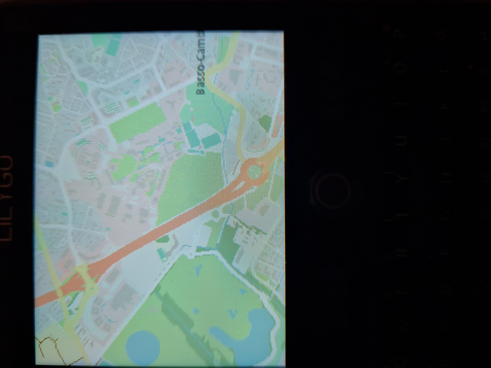

# LoRa APRS Tracker - LVGL UI Edition


**ESP32-S3 LoRa APRS tracker with modern touchscreen interface for Lilygo T-Deck Plus**

This is a fork of [CA2RXU's LoRa APRS Tracker](https://github.com/richonguzman/LoRa_APRS_Tracker) featuring a complete LVGL-based touchscreen interface with vector map rendering (NAV format compatible with [IceNav-v3](https://github.com/jgauchia/IceNav-v3)), LovyanGFX graphics library for enhanced performance, advanced APRS messaging, and optimized memory management.

## Screenshots

||||
|:-:|:-:|:-:|
| **Dashboard** | **Vector Map** | **Messaging** |

---
## What's New in v2.9.x
- **Strict 3D Fix (PDOP)** - New configurable mode to enforce PDOP filtering for altitude reliability, with a visual indicator on the dashboard.
- **Persistent Map State** - Map's NAV memory pool and zoom/pan state are preserved across sessions to avoid PSRAM fragmentation and improve user experience.
- **NeoGPS migration** - Replaced TinyGPS++ (legacy 2013) with NeoGPS: coherent fix merging, HDOP from GGA, configurable sentence parsing
- **GPS Doppler cross-check filter** - New jitter rejection: when GPS reports low speed (< 8 km/h) but position barely moved (< 25m), the update is rejected. Fixes L76K Doppler noise at rest
- **HDOP quality indicator** - Satellite count on dashboard shows signal quality: `+` (≤ 2.0), `-` (2-5), `X` (> 5)
- **Trace z-order fix** - GPS traces now render under station icons
- **Map module refactoring** - `ui_map_manager.cpp` split into `map_state`, `map_tiles`, `map_render`, `map_input` modules (2247 → 655 lines)

## What's New in v2.8.x
- **IceNav pan model** - Ported IceNav integer tile pan model: smooth inertia, no visual snap during async render, decoupled visual offset from render cycle
- **Async rendering Core 0** - Map tiles rendered on Core 0, UI runs on Core 1 without blocking. Double-buffered sprites for tear-free display
- **Fullscreen map** - Double-tap toggles fullscreen mode (hides title/info bars)
- **MapGPSFilter module** - GPS filtering as standalone KISS module with unit tests (GoogleTest)
- **Reliable GPS tracking** - HDOP-adaptive smoothing, stable at rest, responsive at speed, no km-scale jumps
- **Own GPS trace** - 500-point buffer with Douglas-Peucker auto-compaction and zoom-adaptive LOD rendering
- **SD logger** - GPS wall-clock timestamps, ESP_LOGW/E hook captures crash context automatically
- **+32KB DRAM recovered** - Removed useless DMA buffer in storage (PSRAM incompatible with SPI DMA on ESP32-S3)

## What's New in v2.7.x
- **ESP_LOG migration** - Replaced standard Serial.print with native ESP-IDF logging framework with colored terminal output
- **PSRAM LVGL Allocator** - Redirected UI memory to PSRAM to free up critical DRAM
- **NPK2 Multi-region support** - Support for "split packs" NPK2 map files with multi-region roaming
- **Wide Zoom Range** - Map support from Zoom 6 up to 17 with adaptive raster/vector switching
- **Vector map optimizations** - Increased NPK2 row buffer to 8KB in PSRAM for processing complex tiles
- **Web-Conf Stability** - Hardened against memory fragmentation and CPU starvation in configuration mode
- **GPX trace recorder** - Start/Stop button on map, saves tracks to SD card
- **Delta+ZigZag+VarInt NAV format** - 30-50% smaller tiles, compatible with IceNav-v3
- **Robust GPS filtering** - Advanced HDOP adaptive jitter filtering to prevent fake beacons and map spikes
- **NAV raw data cache** - PSRAM cache avoids SD re-reads after pan (30 tiles LRU)
- **Station traces with TTL** - 60-minute time-to-live for received station positions
- **Vector map rendering** - NAV format tiles with roads, paths, water bodies, buildings
- **Dual map modes** - Raster (JPEG/PNG) and Vector (NAV) with adaptive zoom
- **Statistics persistence** - LinkStats and per-station data saved to SD card
- **WiFi Station mode** - Connect to existing networks for internet access
- **APRS-IS Stability** - Extended logresp timeout to 10s with better connection cleanup
- **Display ECO slider** - Configurable timeout for screen dimming
- **Memory optimizations** - Fixed leaks, improved PSRAM usage
- **Stability and UI fixes** - BLE wake crash, SD logger infinite loop, dynamic callsign background width calculation

## Key Features

### Interface
- Full-color touchscreen UI (320x240) with LVGL 8.4
- **LovyanGFX** graphics library (replaces TFT_eSPI for better performance)
- Dashboard with real-time GPS, LoRa, WiFi, battery status
- Interactive map with dual rendering (raster/vector)
- APRS messaging with conversation view
- Touch-friendly configuration screens
- Physical QWERTY keyboard support

### Map System
- **Raster mode**: JPEG/PNG tiles (OpenStreetMap format)
  - Zoom levels: 8, 10, 12, 14, 16, 18 (step 2)
- **Vector mode**: NAV binary format (IceNav-v3 compatible)
  - Zoom levels: 8 to 18 (step 1)
  - Sub-pixel precision rendering
  - Dynamic background color from tiles
- APRS station display with symbols (primary/alternate tables)
- Label rendering with anti-collision detection
- GPS tracking with auto-follow and manual pan

### APRS & Messaging
- Full LoRa APRS support (433MHz)
- Threaded message conversations
- Contact management (add/edit/delete)
- Quick reply from map or station list
- Message history on SD card
- LinkStats and per-station statistics (max 20 stations)

### Hardware
- **Board**: Lilygo T-Deck Plus (ESP32-S3, 16MB Flash, 8MB PSRAM)
- **Display**: 320x240 IPS touchscreen with brightness control
- **LoRa**: SX1262 module
- **GPS**: Internal GPS module
- **Storage**: SD card (A1 class recommended for fast tile loading)
- **Connectivity**: WiFi (AP + Station modes), Bluetooth LE

## Documentation & User Guide

**All instructions for installation, configuration, and usage can be found on the Wiki:**

📖 [**Read the Wiki / User Guide**](https://github.com/moricef/LoRa_APRS_Tracker/wiki)

You will find details about:
- Installation and first boot (Web Flasher / PlatformIO)
- SD card preparation and raster/vector map tiles
- Messaging and UI operation
- Advanced settings

## SD Card Setup

### Directory Structure

Firmware creates these directories automatically on first boot:

```
/LoRa_Tracker/
├── Maps/          # Raster tiles (JPEG/PNG)
├── VectMaps/      # Vector tiles (NAV format)
├── Symbols/       # APRS symbols (24x24 PNG)
│   ├── primary/
│   └── alternate/
├── Messages/
│   ├── inbox/
│   └── outbox/
└── Contacts/
```

### Map Tiles

**Raster tiles (JPEG/PNG)** - Using Python script:
```bash
cd tools/
python download_tiles.py --region france --zoom 8 10 12 14 16 18
# Copy tools/tiles/* to SD:/LoRa_Tracker/Maps/
```

**Raster tiles (JPEG/PNG)** - Using [MOBAC](https://mobac.sourceforge.io/):
1. Select region and tile source (OpenStreetMap)
2. Choose zoom levels: 8, 10, 12, 14, 16, 18
3. Output format: "OSMTracker tile storage"
4. Copy to SD:/LoRa_Tracker/Maps/

**Vector tiles (NAV format)** - Using [Tile-Generator](https://github.com/moricef/Tile-Generator/tree/devel_pack):

Copy output_dir/* to SD:/LoRa_Tracker/VectMaps/

**Note**: Vector mode activates automatically when `/LoRa_Tracker/VectMaps/` directory exists.

### APRS Symbols

Download: [APRS Symbols Pack (Mega)](https://mega.nz/folder/6FUi3DDD#cSdv5-zt18KTWeooz7ZvlA)

Extract to SD card: `/LoRa_Tracker/Symbols/` (primary + alternate folders)

Each symbol: 24x24 PNG file named with hex ASCII code (e.g., `3E.png` for car `>`)

## Configuration

### Web Interface

1. Connect to WiFi AP `LoRa-Tracker-AP`
2. Open browser: `http://192.168.4.1`
3. Configure callsign, APRS settings, preferences

### Configuration File

Edit `data/tracker.json` for advanced settings:
```json
{
  "callsign": "YOURCALL",
  "ssid": 9,
  "symbol": ">",
  "overlay": "/",
  "comment": "LoRa APRS Tracker"
}
```

## Usage

**Dashboard**: BEACON (send position) | MSG (messaging) | MAP (interactive map) | SETUP (settings)

**Map controls**: Touch to pan | +/- buttons to zoom | GPS button to recenter | Tap stations for info

**Keyboard shortcuts**: Enter (send/confirm) | Escape (back/cancel) | Shift (uppercase) | Sym (symbols)

## Operation Without SD Card

Tracker works in degraded mode without SD:
- Map: gray background (no tiles)
- Symbols: red circles (no APRS symbols)
- Messages: not saved persistently
- Config: uses SPIFFS defaults

**Recommendation**: Use SD card with A1 rating (e.g., SanDisk Extreme) for optimal tile loading.

## Technical Details

**Memory**: ~88KB DRAM free during operation, PSRAM for tile/symbol cache and sprites

**Optimizations**:
- **PSRAM Asset Management**: UI allocator and tile/symbol cache redirected to PSRAM
- Synchronous tile rendering (decode + copy + cache)
- RGB565 byte-swap for correct LVGL colors
- Persistent viewport sprite (no fragmentation)
- LRU cache for raster and vector tiles
- Negative cache to avoid repeated SD scans

**Power Management**:
- Display: configurable ECO timeout
- WiFi: periodic sleep
- BLE: auto-disable after 5 min
- GPS: sleep between beacons

## Credits

**Original firmware**: [CA2RXU - Ricardo](https://github.com/richonguzman/LoRa_APRS_Tracker)

**Libraries & inspiration**:
- [LVGL](https://lvgl.io/) - UI library
- [LovyanGFX](https://github.com/lovyan03/LovyanGFX) - Graphics library
- [IceNav-v3](https://github.com/jgauchia/IceNav-v3) - NAV format and vector rendering

**LVGL UI development**: F4MLV with Claude AI assistance

## Support This Project

If you find this project useful:

[PayPal donation](https://paypal.me/moricef09) | [GitHub Sponsors](https://github.com/sponsors/moricef)

**Original project**: Support [CA2RXU](https://github.com/sponsors/richonguzman) too!

## License

Same license as original CA2RXU LoRa APRS Tracker.

Map data: © [OpenStreetMap contributors](https://www.openstreetmap.org/copyright)

## Issues & Support

**LVGL UI issues**: [Open issue on this fork](https://github.com/moricef/LoRa_APRS_Tracker/issues)

**General tracker issues**: See [original project](https://github.com/richonguzman/LoRa_APRS_Tracker)

---

73! F4MLV
